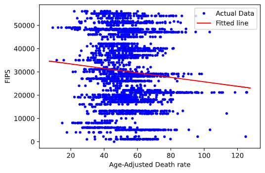
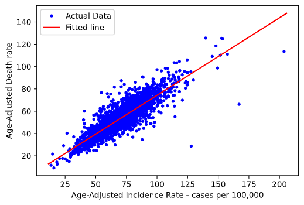

## Question 1

From data, we have $\overline{\mu} = 0.0554$, we take the hypothesis of it being equal to $0.05$. The t-statistic we get is $0.53$ and the critical t value is $1.96$ for 5% level of significance.

So the hypothesis that $\mu = \mu_0 = 0.055$ cannot be rejected at 95% confidence.

## Question 2

From data, we have $\overline{\sigma^2} = 0.00316$. So we take the hypothesis of
population variance being $0.03$. The non-rejection interval we get is $[4804.0, 5196.9]$ and the chi-squared statistic as $5266.65$, which lies in the rejection region.

So the hypothesis that $\sigma^2 = \sigma_0^2 = 0.03$ can be rejected at 95% confidence.

## Question 3

In assignment 1, we found that the distribution that best fits the data is an
exponential distribution with $\lambda = 18.05$.

We performed goodness of test by dividing the given data into appropriate
intervals. The statistic we obtained was $29.75$ and the chi-squared table value
is $43.77$. So the null of the data following some other distribution cannot be
rejected at 95% confidence.

## Question 4

The data from the link http://iitd.info/a3regressiondata is not accessible, so the other data provided has been considered. The instructions said to choose one of the 2 CSV files provided. However, upon inspection of the variable names, it doesn't seem to make sense since "FIPS" is a geographic code (like PIN code).

So this question is performed twice here, first with FIPS as dependent variable and Age-Adjusted Death rate as independent variable (as per assignment instructions). In the other way, the 2 CSV files are joined with FIPS as a common column and regression is performed with Age-Adjusted Incident Rate being independent variable
and Age-Adjusted Death Rate being the dependent variable.

### Age-adjusted death rate vs FIPS

- **Question (4a)**: Estimate of slope = -95.91, intercept = 35323.81
  
- **Question (4b)**:

    

- **Question (4c)**: Estimate for $\sigma^2 = 229335846.73$

- **Question (4d)**: $R^2 = 0.0078$, adjusted $R^2 = 0.0071$

- **Question (4e)**:

  - For slope: T statistic = $-4.71$ and critical value = $1.96$. So the slope is statistically significant (different from zero) at 95% confidence level.

  - For Intercept: T statistic = $31.66$ and critical value = $1.96$. So the intercept is statistically significant (different from zero) at 95% confidence level.

- **Question (4f)**: Since we only performed simple regression (and not multiple regression), the hypothesis of all partial slope coefficients being simultaneously equal to zero is the same as the hypothesis of the slope coefficient to be equal to zero. We have shown in previous question that this hypothesis can be rejected at 95% confidence level.

### Age-adjusted Incidence rate vs Age-adjusted Death rate

- **Question (4a)**: Estimate of slope = 0.695, intercept = 4.79
  
- **Question (4b)**:

    

- **Question (4c)**: Estimate for $\sigma^2 = 49.71$

- **Question (4d)**: $R^2 = 0.7548$, adjusted $R^2 = 0.7546$

- **Question (4e)**:

  - For slope: T statistic = $88.84$ and critical value = $1.96$. So the slope is statistically significant (different from zero) at 95% confidence level.

  - For Intercept: T statistic = $8.45$ and critical value = $1.96$. So the intercept is statistically significant (different from zero) at 95% confidence level.

- **Question (4f)**: Since we only performed simple regression (and not multiple regression), the hypothesis of all partial slope coefficients being simultaneously equal to zero is the same as the hypothesis of the slope coefficient to be equal to zero. We have shown in previous question that this hypothesis can be rejected at 95% confidence level.
